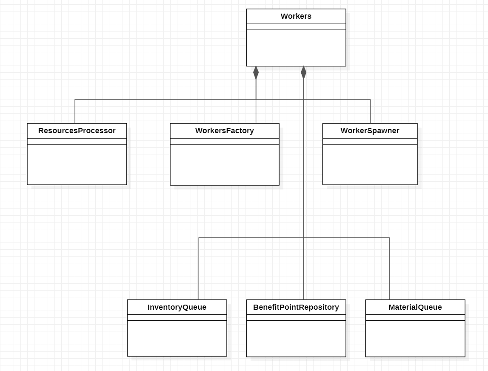
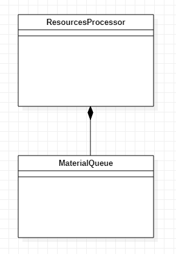
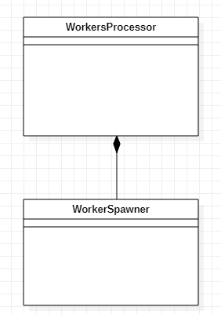
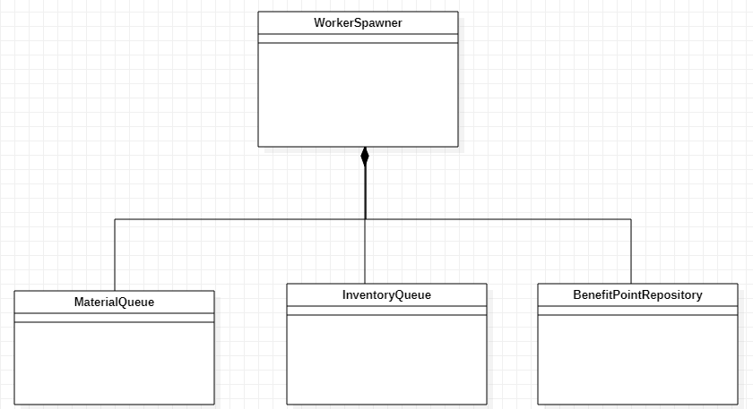

  
  

# 
Trabajo práctico 2 - Trabajadores y recolectores

### 
Taller de programación 1 - Veiga - 1er Cuatrimestre 2020

  

| | |
|---|---|
|  Alumno | Federico Jure  |
| Padrón  |  97598 |
| Email   | fedejure@gmail.com |
## [
Repositorio fuente](https://github.com/FedeJure/Workers)

  

----------------------------------

## Descripción del trabajo realizado

El presente trabajo se realizo en C++11 utilizando unicamente librerias estandar.
El programa representa un juego de estrategia en el cual el objetivo es obtener puntos de beneficios a partir de materia prima extraida del mapa.  
AL iniciar el programa se pasa el mapa de recursos, y la configuracion de los trabajadores los cuales corren cada uno en un thread de procesamiento distinto. 
 
El foco de este trabajo practico es usar procesamiento multi-threading  y el correcto manejo de recursos de forma concurrente.

-----------------------------------

## Modelo de dominio
__Workers__: Clase principal del programa cuya responsabilidad es inicializar los recursos compartidos y compartirlo con las demas clases. 

__MaterialQueue__: Modela un repositorio de materiales basado en una cola bloqueante que permite obtener los materiales ni bien estén disponibles. 

__InventoryQueue__: Modela un repositorio de materiales basado en una cola bloqueante, el cual guarda materiales y devuelve puntos de beneficios. A diferencia de la de materiales, la condicion para extraer los materiales en forma de puntos de beneficios es que haya materiales suficientes que un trabajador necesita para procesar y convertirlos en puntos. 

__BenefitPointRepository__: Modela un repositorio de puntos de beneficio. 

__Gatherer__: Modela un recolector, el cual se encola en MaterialQueue, y ni bien hay un material lo extrae, lo procesa y lo deposita en el InventoryQueue. 

__Producer__: Modela un productor, el cual se encola en InventoryQueue a la espera que haya suficientes materiales disponibles para extraerlos, procesarlos y generar puntos de beneficios los cuales deposita en BenefitPointRepository. 

__WorkerSpawner__: Modela una fabrica de trabajadores. 

__ResourcesProcessor__: Modela un procesador del mapa de materiales. Procesa cada uno de los materiales en el orden que estan dispuestos en el mapa y los va depositando en el contenedor correpondiente para el tipo de material. 

__WorkersProcessor__: Modela un procesador del archivo de configuarcion de trabajadores. Se comunica con el WorkerSpawner pasandole la cantidad de cada tipo de trabajador a generar. 

---------------
## Diagramas de clases

---------------